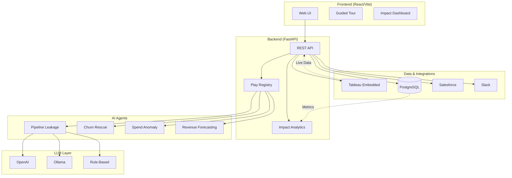

# Agentic Analytics Studio (AAS)

**Transform Business Questions into Actionable Insights with AI-Powered Agents**

[](https://opensource.org/licenses/MIT)
[](https://www.python.org/downloads/)
[](https://fastapi.tiangolo.com)

Agentic Analytics Studio (AAS) is a production-ready "analytics-to-action" platform that transforms business questions into concrete operational tasks. By combining intelligent agents, live data visualization, and enterprise integrations, AAS enables business users to ask questions like **"Why are my deals slipping?"** and receive prioritized, actionable recommendations with AI-generated rationales.

---

## 🎯 Overview

AAS is not just a dashboard—it's an intelligent workspace that:
1. **Analyzes** your data using specialized AI agents
2. **Recommends** prioritized actions based on financial impact
3. **Executes** tasks automatically in Salesforce, Slack, and other systems
4. **Tracks** aggregate business impact with exportable reports

### Key Differentiators
- **🤖 Multi-Play Architecture**: 4 specialized agents (extensible to unlimited plays)
- **🧠 LLM-Agnostic**: Supports OpenAI, Ollama, or deterministic fallback
- **🔒 Production-Ready**: Stub/live modes, comprehensive error handling, unit tests
- **📊 Impact Quantification**: Real-time ROI dashboard with $3.25M+ estimated value
- **🎓 Guided Onboarding**: Interactive tour for instant comprehension
- **🔌 Modular & Extensible**: Third-party play API with template and documentation

---

## ✨ Features

### Hero Plays (Intelligent Agents)
| Play | Problem | Solution | Impact |
|------|---------|----------|--------|
| **💰 Pipeline Leakage** | Deals quietly die in pipeline | Identify at-risk deals, auto-create Salesforce tasks | $1.5M recovered revenue |
| **🛟 Churn Rescue** | Customers churn without warning | Detect churn-risk segments, queue retention outreach | $450K retention value |
| **📊 Spend Anomaly** | Surprise budget spikes discovered too late | Detect anomalies, trigger budget holds | $300K cost avoidance |
| **📈 Revenue Forecasting** | Revenue shortfalls catch teams off-guard | Forecast gaps, recommend proactive interventions | $1.2M pipeline acceleration |

### Platform Capabilities
- **🎯 Modular Play Registry**: Add new plays in <10 minutes with template
- **📊 Impact Analytics Dashboard**: Aggregate ROI metrics with CSV/JSON export
- **🔄 Tableau Integration**: Live data visualization with JWT authentication
- **💬 Slack Notifications**: Real-time alerts for approved actions
- **🏢 Salesforce Integration**: Stub/live modes with task preview
- **🎓 Interactive Tour**: 6-step guided onboarding (Shepherd.js)
- **🧪 Comprehensive Testing**: Unit tests with CI/CD (GitHub Actions)

---

## 🚀 Quick Start

### Prerequisites
- **Python 3.10+**
- **Node.js 16+** & npm
- **PostgreSQL 13+** (optional, works with mock data)
- **Git**

### Installation

```bash
# Clone the repository
git clone https://github.com/HooplaHoorah/Agentic-Analytics-Studio.git
cd Agentic-Analytics-Studio

# Backend setup
python -m venv .venv
source .venv/bin/activate  # Windows: .venv\Scripts\activate
pip install -r requirements.txt

# Frontend setup
cd web
npm install
cd ..

# Configure environment
cp .env.example .env
# Edit .env with your credentials (optional - works in stub mode by default)
```

### Running the Application

```bash
# Terminal 1: Start backend
uvicorn aas.api:app --reload --port 8000

# Terminal 2: Start frontend
cd web
npm run dev
# Opens at http://localhost:5173

# Optional: Run tests
pytest
```

### First Run Experience
1. Open http://localhost:5173
2. Interactive tour auto-starts (or click "🎯 Try Demo")
3. Select a play from dropdown (e.g., "Revenue Forecasting")
4. Click "Run Pipeline Audit"
5. Review AI-generated recommendations with impact scores
6. Approve actions to see Salesforce/Slack integration

---

## ⚙️ Configuration

### Environment Variables

Copy `.env.example` to `.env` and configure as needed. **All integrations are optional** and default to safe stub modes.

#### Core Settings
| Variable | Description | Default | Required |
|----------|-------------|---------|----------|
| `DATABASE_URL` | PostgreSQL connection string | Mock mode | No |
| `LOG_LEVEL` | Logging verbosity | `INFO` | No |
| `PORT` | Backend port | `8000` | No |

#### LLM Provider (AI Rationales)
| Variable | Description | Default | Required |
|----------|-------------|---------|----------|
| `LLM_PROVIDER` | `openai`, `ollama`, or `none` | `none` | No |
| `OPENAI_API_KEY` | OpenAI API key | - | If using OpenAI |
| `OPENAI_MODEL` | Model name | `gpt-3.5-turbo` | No |
| `OLLAMA_BASE_URL` | Ollama API endpoint | `http://localhost:11434/api` | If using Ollama |
| `OLLAMA_MODEL` | Ollama model name | `llama3` | If using Ollama |

**Note**: With `LLM_PROVIDER=none`, AAS uses deterministic keyword-based rationales (no API calls).

#### Salesforce Integration
| Variable | Description | Default | Required |
|----------|-------------|---------|----------|
| `SALESFORCE_MODE` | `stub` or `live` | `stub` | No |
| `SF_USERNAME` | Salesforce username | - | If `live` mode |
| `SF_PASSWORD` | Salesforce password | - | If `live` mode |
| `SF_SECURITY_TOKEN` | Salesforce security token | - | If `live` mode |
| `SF_DOMAIN` | Salesforce domain | `login` | No |

**Stub Mode** (default): Returns preview of tasks that would be created (safe for demos)  
**Live Mode**: Creates real Salesforce tasks (requires credentials)

#### Tableau Visualization
| Variable | Description | Required |
|----------|-------------|----------|
| `TABLEAU_SERVER_URL` | Tableau Cloud URL | For live viz |
| `TABLEAU_SITE_ID` | Site identifier | For live viz |
| `TABLEAU_CONNECTED_APP_CLIENT_ID` | Connected App client ID | For live viz |
| `TABLEAU_CONNECTED_APP_SECRET_ID` | Secret ID | For live viz |
| `TABLEAU_CONNECTED_APP_SECRET_VALUE` | Secret value | For live viz |
| `TABLEAU_CONNECTED_APP_USERNAME` | Tableau username | For live viz |
| `TABLEAU_VIZ_URL_PIPELINE` | Pipeline Leakage viz URL | For live viz |
| `TABLEAU_VIZ_URL_CHURN` | Churn Rescue viz URL | For live viz |
| `TABLEAU_VIZ_URL_SPEND` | Spend Anomaly viz URL | For live viz |
| `TABLEAU_VIZ_URL_REVENUE` | Revenue Forecasting viz URL | For live viz |

#### Slack Notifications
| Variable | Description | Required |
|----------|-------------|----------|
| `SLACK_BOT_TOKEN` | Slack bot token | For notifications |
| `SLACK_CHANNEL` | Default channel ID | For notifications |

---

## 📊 Impact Methodology

AAS quantifies business impact using heuristic calculations based on your data:

### Impact Score Calculation
```python
# Example: Pipeline Leakage
impact_score = (deal_value * probability_to_close * urgency_factor) / 1000

# Example: Revenue Forecasting
impact_score = revenue_shortfall / 1000  # In thousands
```

### Estimated Dollar Value
```python
estimated_value = total_impact_score * $1,000
# Example: Impact score of 3,250 = $3,250,000 estimated value
```

**Important**: These are **estimates** based on provided data and assumptions. Actual value depends on:
- Data quality and completeness
- Business context and market conditions
- Execution effectiveness
- Time to implementation

The $3.25M figure shown in demos represents aggregate impact across all plays and actions. This is **not financial advice** but a directional indicator for prioritization.

---

## 🏗️ Architecture



### Data Flow
1. **User selects play** → Frontend calls `/run/{play}`
2. **Agent loads data** → From Tableau, database, or CSV
3. **Agent analyzes** → Calculates metrics, identifies issues
4. **Agent recommends** → Generates prioritized actions with impact scores
5. **LLM generates rationales** → OpenAI/Ollama/fallback provides reasoning
6. **Actions displayed** → User reviews and approves
7. **Execution** → Salesforce tasks created, Slack notifications sent
8. **Impact tracked** → Metrics aggregated in analytics dashboard

---

## 🧪 Testing

### Run Unit Tests
```bash
# All tests
pytest

# Specific module
pytest tests/test_salesforce_client.py

# With coverage
pytest --cov=aas --cov-report=html

# Verbose output
pytest -v
```

### Test Coverage
- ✅ Salesforce client (stub/live modes)
- ✅ Play registry (registration, retrieval)
- ✅ Impact analytics (calculations, exports)
- ✅ Agent logic (recommendations, impact scoring)

### Manual Testing
```bash
# Test Revenue Forecasting
python test_revenue_forecasting.py

# Or use demo script
.\scripts\demo_revenue_forecasting.ps1
```

---

## 📚 Documentation

- **[Play API Guide](docs/play_api.md)** - How to create custom plays
- **[Epic Summaries](instructions%20for%20Antigravity/)** - Implementation details
- **[Template Play](aas/agents/template_play.py)** - Starter template for new plays

### Adding a New Play

1. **Create agent** (inherit from `AgentPlay`):
```python
# aas/agents/my_play.py
from .base import AgentPlay
from ..models.action import Action

class MyPlayAgent(AgentPlay):
    def load_data(self): ...
    def analyze(self, data): ...
    def recommend_actions(self, analysis): ...
```

2. **Register play**:
```python
# aas/plays/plays.py
register_play(
    id="my_play",
    label="My Play",
    description="Brief description",
    agent_class=MyPlayAgent,
    tags=["category"],
    icon="🎯"
)
```

3. **Add to UI** (optional for static frontends):
```html
<option value="my_play">My Play</option>
```

See [docs/play_api.md](docs/play_api.md) for complete guide.

---

## 🤝 Contributing

We welcome contributions! See [CONTRIBUTING.md](CONTRIBUTING.md) for guidelines.

### Development Workflow
1. Fork the repository
2. Create a feature branch (`git checkout -b feat/my-feature`)
3. Make changes with clear commit messages
4. Add tests for new functionality
5. Run `pytest` and ensure all tests pass
6. Open a Pull Request with description

### Code Style
- Python: Follow PEP 8, use `black` for formatting
- JavaScript: Use ESLint configuration
- Commits: Use conventional commits (feat:, fix:, docs:, etc.)

---

## 📈 Roadmap

### Completed ✅
- [x] Multi-play architecture (4 hero plays)
- [x] Modular play registry
- [x] Impact analytics dashboard
- [x] Salesforce stub/live integration
- [x] Interactive onboarding tour
- [x] LLM provider abstraction
- [x] Unit test coverage

### In Progress 🚧
- [ ] Additional LLM providers (Anthropic, Gemini)
- [ ] Slack Block Kit interactive messages
- [ ] Automated CI/CD pipeline
- [ ] Sample datasets for all plays

### Future Enhancements 🔮
- [ ] Customer Segmentation play
- [ ] Real-time collaboration features
- [ ] Advanced caching & performance optimization
- [ ] Multi-language support (i18n)

---

## 📄 License

This project is licensed under the MIT License - see the [LICENSE](LICENSE) file for details.

---

## 🙏 Acknowledgments

- Built for the Tableau Hackathon 2026
- Powered by FastAPI, React, Tableau Embedding API, and Shepherd.js
- AI rationales via OpenAI GPT-3.5 or Ollama

---

## 📞 Support

- **Issues**: [GitHub Issues](https://github.com/HooplaHoorah/Agentic-Analytics-Studio/issues)
- **Discussions**: [GitHub Discussions](https://github.com/HooplaHoorah/Agentic-Analytics-Studio/discussions)
- **Documentation**: [docs/](docs/)

---

**Made with ❤️ by the AAS Team**
