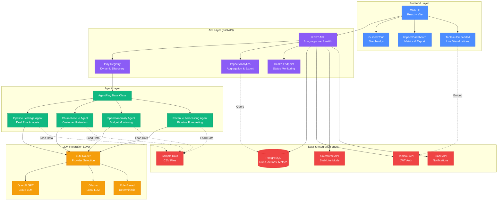

# Agentic Analytics Studio - Architecture

## System Architecture



## Data Flow

### 1. User Initiates Analysis
```
User → UI → API (/run/{play}) → Play Registry → Agent
```

### 2. Agent Execution
```
Agent → load_data() → analyze() → recommend_actions()
                ↓           ↓              ↓
         Sample Data    Metrics      Actions + Impact Scores
```

### 3. LLM Rationale Generation
```
Agent → LLM Router → [OpenAI | Ollama | Fallback] → AI Rationale
```

### 4. Action Approval & Execution
```
User → UI → API (/approve) → Salesforce Client → [Stub Preview | Live API Call]
                           → Slack Client → Notification
                           → Database → Execution Record
```

### 5. Impact Analytics
```
Database → Analytics Module → Aggregate Metrics → Impact Dashboard
                                                 → CSV/JSON Export
```

## Component Responsibilities

### Frontend (Web UI)
- **Purpose**: User interface for play selection, results display, action approval
- **Tech Stack**: HTML, CSS, JavaScript (ES6), Shepherd.js
- **Key Features**:
  - Interactive guided tour
  - Play selector dropdown
  - Tableau embedded visualizations
  - Action cards with impact scores
  - Impact analytics dashboard

### API Layer (FastAPI)
- **Purpose**: REST API for agent orchestration and data access
- **Endpoints**:
  - `GET /health` - System status
  - `GET /plays` - List available plays
  - `POST /run/{play}` - Execute agent
  - `POST /approve` - Approve actions
  - `GET /context/actions` - Filtered actions
  - `GET /api/impact/summary` - Impact metrics
  - `GET /api/impact/export` - Download report
  - `GET /tableau/jwt` - Tableau authentication

### Play Registry
- **Purpose**: Dynamic play discovery and instantiation
- **Features**:
  - Declarative registration (`register_play()`)
  - Rich metadata (tags, schemas, icons)
  - Third-party extensibility
  - Backward compatibility

### Agent Layer
- **Purpose**: Business logic for each hero play
- **Base Class**: `AgentPlay`
  - `load_data()` - Data acquisition
  - `analyze()` - Metric calculation
  - `recommend_actions()` - Action generation
  - `generate_rationale()` - LLM integration
- **Agents**:
  - Pipeline Leakage: Deal risk analysis
  - Churn Rescue: Customer retention
  - Spend Anomaly: Budget monitoring
  - Revenue Forecasting: Pipeline forecasting

### LLM Integration
- **Purpose**: AI-powered rationale generation
- **Providers**:
  - OpenAI: Cloud-based GPT models
  - Ollama: Local LLM deployment
  - Fallback: Deterministic keyword-based
- **Mode Selection**: Via `LLM_PROVIDER` environment variable

### Data & Integration Layer
- **PostgreSQL**: Persistent storage for runs, actions, executions
- **Tableau**: Live data visualization with JWT authentication
- **Salesforce**: Task creation (stub/live modes)
- **Slack**: Real-time notifications
- **Sample Data**: CSV files for offline demos

## Security & Configuration

### Environment-Driven Configuration
- All integrations are optional
- Safe defaults (stub modes)
- No hardcoded credentials
- Graceful degradation

### Stub/Live Modes
- **Salesforce**: `SALESFORCE_MODE=stub|live`
  - Stub: Returns preview of actions
  - Live: Creates real tasks
- **LLM**: `LLM_PROVIDER=none|openai|ollama`
  - None: Deterministic fallback
  - OpenAI/Ollama: Real API calls

### Error Handling
- Comprehensive try/catch blocks
- User-friendly error messages
- Server-side logging
- No stack trace exposure to UI

## Scalability Considerations

### Current Architecture
- Single-instance FastAPI server
- PostgreSQL for persistence
- Stateless API design
- Client-side state management

### Future Enhancements
- Horizontal scaling with load balancer
- Redis for caching and session management
- Message queue for async action execution
- Microservices for agent isolation
- Kubernetes deployment

## Technology Stack

### Backend
- **Framework**: FastAPI 0.104+
- **Language**: Python 3.10+
- **Database**: PostgreSQL 13+
- **ORM**: psycopg2 (raw SQL)
- **Testing**: pytest

### Frontend
- **Build Tool**: Vite
- **Language**: JavaScript (ES6)
- **UI Library**: Vanilla JS (no framework)
- **Tour**: Shepherd.js
- **Visualization**: Tableau Embedding API V3

### Integrations
- **LLM**: OpenAI API, Ollama
- **CRM**: Salesforce (simple-salesforce)
- **Chat**: Slack (slack-sdk)
- **Analytics**: Tableau Connected Apps

### DevOps
- **Version Control**: Git + GitHub
- **CI/CD**: GitHub Actions (planned)
- **Deployment**: Uvicorn (ASGI server)
- **Monitoring**: Health endpoint + logs

---

**Last Updated**: 2026-01-02  
**Version**: 1.0
